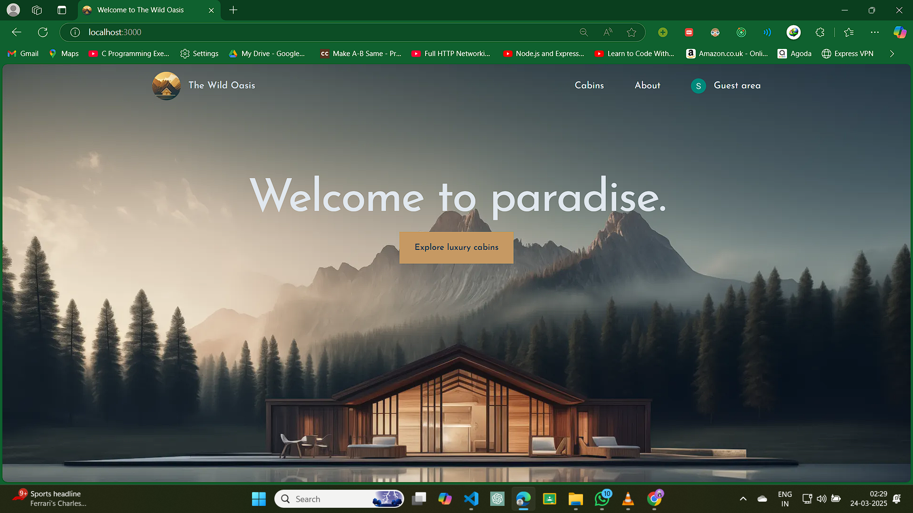
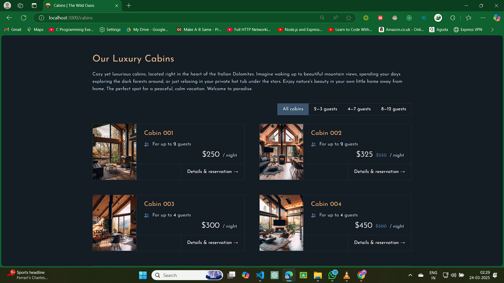
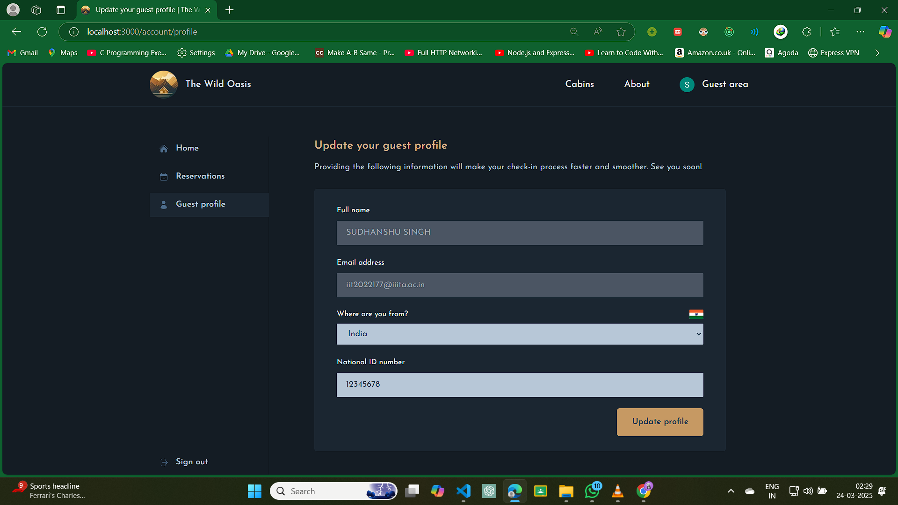

# The Wild Oasis - Customer Facing Website

## 🌿 Overview

The **Wild Oasis Customer-Facing Website** is a platform designed for potential
and actual guests of the Wild Oasis Hotel. Guests can explore cabin details,
check availability, make reservations, and manage their bookings with ease.

## 🚀 Features

### 🏨 **Hotel & Cabin Information**

- Guests can **learn all about the Wild Oasis Hotel**.
- Detailed descriptions and images of each cabin.
- Ability to see booked dates for each cabin.

### 🔎 **Cabin Filtering & Availability**

- Guests can **filter cabins** by their maximum guest capacity.
- View available cabins for specific date ranges.

### 🛏 **Reservation System**

- Guests can **reserve a cabin** for a specific date range.
- **Reservations are not paid online**; payment is done upon arrival.
- New reservations are initially marked as **"unconfirmed"** until check-in.

### 📅 **Booking Management**

- Guests can **view all past and future reservations**.
- Ability to **update or delete reservations**.

### 🔐 **User Authentication & Profiles**

- Guests must **sign up and log in** before making a reservation.
- Each guest receives a **profile in the database** upon signup.
- Guests can **set and update basic profile data** to streamline check-in.

## 🛠 Tech Stack

- **Framework:** Next.js
- **Backend:** Supabase (PostgreSQL, Authentication, Storage)
- **Styling:** Tailwind CSS
- **Authentication:** Auth.js
- **State Management:** Context API for minimal global state management
- **Date Handling:** Date-fns

## 📸 Screenshots

## 📞 Contact

For any queries, reach out to [sudh4800@gmail.com].

## License

This project is licensed under the [MIT License](./LICENSE).
